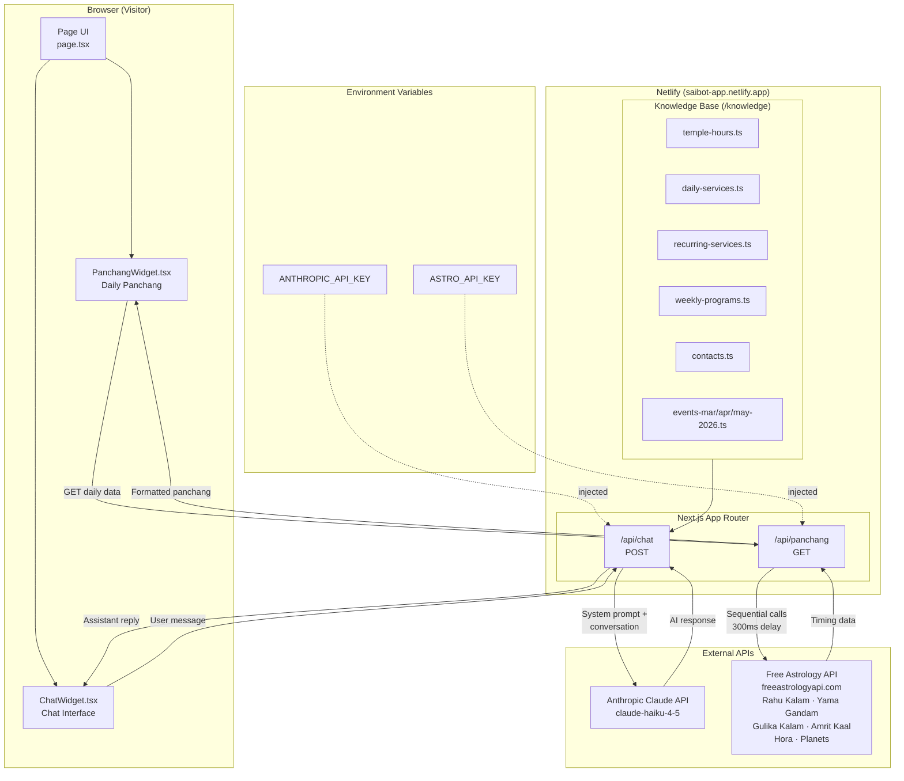

# Sai Sevak – Architecture Diagram



## Component Summary

| Layer | Component | Role |
|-------|-----------|------|
| **Frontend** | `ChatWidget` | Sends user messages, displays conversation |
| **Frontend** | `PanchangWidget` | Fetches and renders daily panchang on load |
| **API** | `/api/chat` | Builds system prompt from knowledge files, calls Claude, validates/trims messages |
| **API** | `/api/panchang` | Calls 6 astrology endpoints sequentially, formats ET timings |
| **Knowledge** | `/knowledge/*.ts` | Static temple data injected into Claude's system prompt at request time |
| **External** | Claude Haiku | Generates natural language responses |
| **External** | Free Astrology API | Provides Vedic astrology calculations for Suwanee GA location |
| **Infra** | Netlify | Hosts app, stores env secrets, serves serverless functions |

## Data Flow

### Chat
1. Visitor types a question in `ChatWidget`
2. `POST /api/chat` receives the message history
3. All knowledge files are compiled into the system prompt
4. Claude Haiku generates a response
5. Response is returned and displayed in the chat

### Panchang
1. `PanchangWidget` calls `GET /api/panchang` on page load
2. Server fetches 6 endpoints from freeastrologyapi.com sequentially
3. Times are formatted in America/New_York timezone
4. Widget displays inauspicious timings (red) and auspicious timings (green)
```
